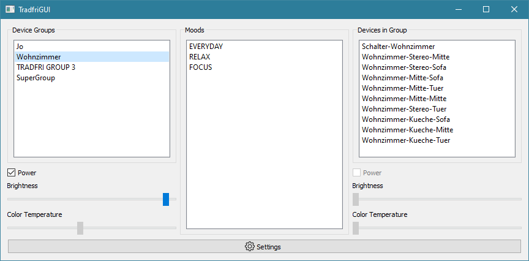

# Tradfri GUI

Simple Qt based Tradfri GUI implemented in Python.

## Requirements

### Running

- Python >=3.6
- PySide2 ~=5.14
- [pytradfri](https://github.com/ggravlingen/pytradfri) master checkout

### Building

**Windows:**

- `pywin32`
- `pywin32-ctypes`
- NSIS
- `libcoap.dll`/`coap-client.exe` (supplied in the `bin` dir, you may rebuild them yourself if you want)

**All Systems:**

- Poetry
- `pyinstaller`

## Building

### Windows

1. Make sure you have NSIS installed.
2. Make sure you have a Version of Python>=3.6 installed (Not the Microsoft Store Version!)
3. Install `poetry`: `pip install poetry`
4. Create a virtualenv: `poetry install`
5. Run the build script: `./build.ps1`

The build script will create an installation in `dist/TradfriGUI` and an installer file in `dist`

### Linux

1. Create virtualenv `python -m venv .venv`
2. Activate virtualenv `. .venv/bin/activate`
3. Install `poetry`: `pip install poetry`
4. Install dependencies: `poetry install`
5. Install `coap-client` and `libcoap`:
    - Archlinux: See AUR https://aur.archlinux.org/packages/libcoap-git/
    - Ubuntu: `libcoap`
6. Either run directly:
    - `python src/main.py`
7. Or build distribution:
    - `./build.sh [--onefile|--onedir]`

### Mac OS

Should work like on Linux, you may need to fetch `libcoap` and `coap-client` from Homebrew
